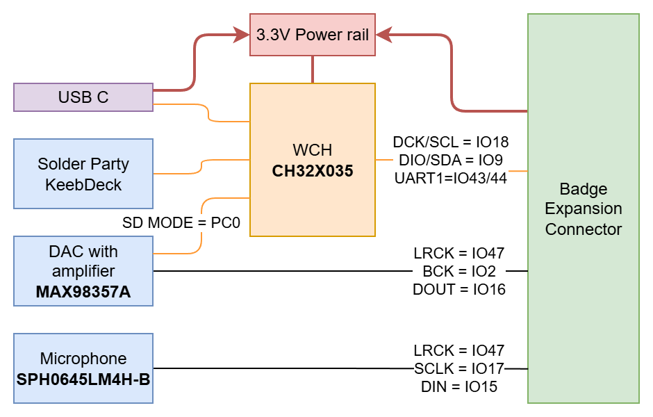

# Communicator 2026
In deze Git repository kan je de ontwerpbestanden en productiedata vinden van de [Fri3d Camp](https://fri3d.be/) 2026 communcator add-on. Revisie 01 is de versie die je in de zakjes kan terugvinden.

De PCB bevat volgende elementen:

- [WCH CH32X035](https://www.wch-ic.com/products/CH32X035.html) microcontroller voor het keyboard
- [I²S Microfoon](datasheets/MIC.pdf)
- [I²S DAC met versterker](datasheets/AMP.pdf)

In de zak zal je ook nog volgende items aantreffen:

- [Luidspreker](Datasheets/SPK.pdf)
- 2 lange pin headers
- Cover PCB
- 4 lange plastieken spacers
- 4 korte plastieken spacers

Je zal zelf de speaker en pin headers nog moeten solderen, het siliconen keyboard op de PCB monteren met de afdekplaat en het op de badge klikken.

Het keyboard werkt ook als USB keyboard.

[//]: # ()

# Communicator 2026 (EN)
Communicator addon for the Fri3d Badge based on the [Solder Party KeebDeck Keyboard](https://www.solder.party/keeb/). The design is very similar to the [previous generation](https://github.com/Fri3dCamp/communicator_2024) but we ditched the [LANA TNY](https://phyx.be/LANA_TNY/) module in favor of the [WCH CH32X035](https://www.wch-ic.com/products/CH32X035.html) microcontroller. 
